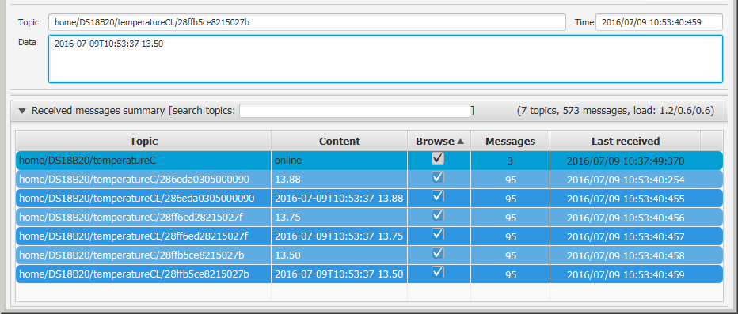
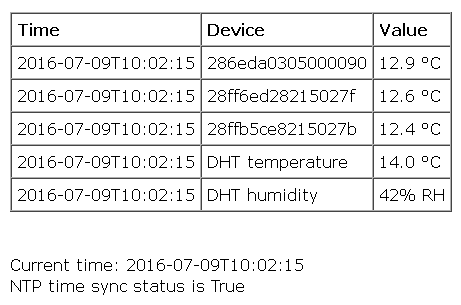
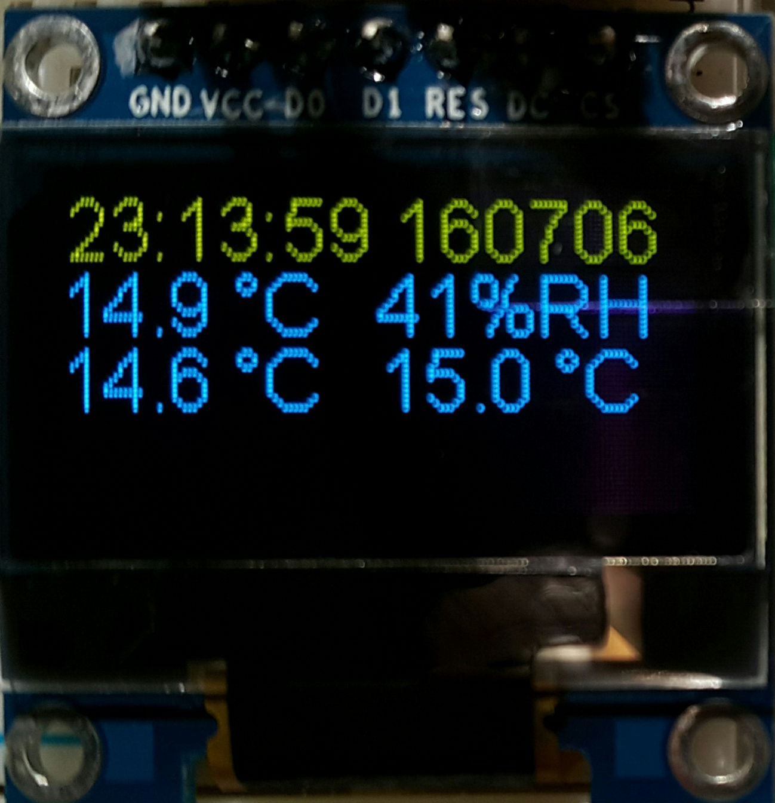
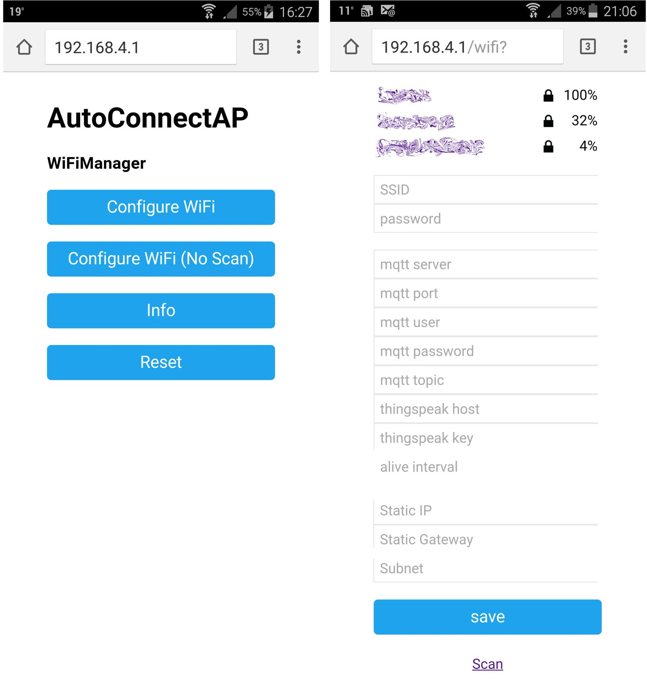

# Multiple DS18B20 

## Overview
### Use case

I have a need to measure, display and store temperatures for two applications: my solar panels and a 3D printer. 

Three DS18B20 sensors are attached to the back of three of solar panels.  The ESP is located in the roof under the solar panels and not within easy reach, so the temperatures are sent to a Raspberry Pi for further distribution and display. It would also be nice have the ESP serve the temperature values in an onboard web server on the locall network.
 
When my 3D printer arrives I want to measure the temperature at different locations in and around the printer. As a bonus, it will be nice to measure the humidity in the filament storage box as well (3D printer filament is sensitive to humidity).

In both applications I need accurate time recording, so some external time reference is required.

### Objective

This project measures and displyas DS18B20 temperatures with the following objectives:

1. Standalone ESP8266, connected by fixed IP address on wifi to the rest of the network.
1. The ESP must be programmable/flashable over the air (OTA) once deployed.
2. Ideally the ESP must be dynamically configured: device parameters must not be hardcoded.
1. The ESP must publish regular MQTT messages with time and temperature.
1. Multiple DS18B20 sensors, with proper identification.
1. To timestamp the environmental data I added a local wall clock time library,  synchronised with NTP servers on the internet.  The time is synchronised at regular intervals.
2. All measured parameters must be displayed on a small OLED device.

## Software
### Source code and development environment

The code developed here uses the Arduino ESP8266 core framework,  in the [platformio-ide](https://github.com/NelisW/myOpenHab/blob/master/docs/413b-ESP8266-PlatformIO-Arduino-Framework.md), with [platformio](http://platformio.org/) used from within the [atom](https://atom.io/) editor.  Using the Arduino core libraries simplifies the coding considerably compared to writing code in the Expressif SDK. PlatformIO is a much easier environment to use than The Arduino IDE.  T

### Libraries
The project uses the following libraries:

1. [PubSubClient](http://platformio.org/lib/show/89/PubSubClient) MQTT client to publish and subscribe to topics. Install in platformio terminal with `platformio lib install 89`.

2. [DallasTemperature](http://platformio.org/lib/show/54/DallasTemperature) to read the DS18B20 temperature sensor.  Install in platformio terminal with `platformio lib install 54`.

3. [OneWire](http://platformio.org/lib/show/1/OneWire) to provide the onewire library required by the DS18B20 sensor.  Install in platformio terminal with `platformio lib install 1`.

4. [WifiManager](http://platformio.org/lib/show/567/WifiManager) to provide the WifiManager library to default to Access Point mode if Station Mode fails.  Install in platformio terminal with `platformio lib install 567`.

4. [Json](http://platformio.org/lib/show/64/Json) to provide the Json library to read and write files to the filesystem.  Install in platformio terminal with `platformio lib install 64`.

5. [ESP8266_SSD1306](http://platformio.org/lib/show/562/ESP8266_SSD1306) to provide an interface to drive the OLED display.  Install in platformio terminal with `platformio lib install 562`. The use of this library is optional and must be included in the build with a `#define`.

5. [DHT](http://platformio.org/lib/show/19/Adafruit-DHT) to provide an interface to the DHT11. Install in platformio terminal with `platformio lib install 19`.   The use of this library is optional and must be included in the build with a `#define`.

Install the required libraries using the platformio command line method. The easiest method is to work in an environment with no proxies (and set your PC to no proxy) and then type the following at the command line:

    platformio lib install XX

where XX is the library number in the platformio library of libraries. The libraries will be installed in the general platformio library folder (`%USER%\.platformio\lib`), not in your project folder.  You may find it illuminating to work through the libraries downloaded here to see what happens behind the scenes. The library authors put in a huge effort to make life easier for us on the Arduino framework level.

For more information on how to load the libraries see the [platformio library registry](http://platformio.org/lib) website or [here](https://github.com/NelisW/myOpenHab/blob/master/docs/413b-ESP8266-PlatformIO-Arduino-Framework.md).

### Controller concept

Most events don't directly control any functionality, the events rather trigger semaphores or flags in the interrupt or timer callback routines.   The interrupt service routines are very small and fast, only setting the flags, hence it returns quickly after servicing the interrupt. The control changes take place in the `loop()` function, as prescribed by the flag settings. When action is taken in the `loop()` function, the flags are reset. This approach ensures stable interrupt and timer operation. 

In a way this design follows the principles of [distributed microservices](http://martinfowler.com/articles/microservices.html) where eash small part of the design has a clear specification and interface and prepares/processes only a small part of the total process.  The concept is well summarised [here](http://brunorocha.org/python/microservices-with-python-rabbitmq-and-nameko.html): "In brief a Micro Service Architecture exists when your system is divided in small (single context bound) responsibilities blocks, those blocks doesn't know each other, they only have a common point of communication, generally a message queue, and does know the communication protocol and interfaces."  In this project we use MQTT between the ESP-based alarm and the rest of the world, but inside this software we use flags/semaphores to signal actions between different parts of the code.  Most of the action influencing the work happens in interrupt or timer service routines, but the actual time consuming work takes place in the `loop()` phase. This approach hardens the execution of the software against time overruns or blocking interrupts.  The end result is stable software execution.

### DS18B20

Any number of sensors can be placed on the bus. It seems that the code requires at least one device on the bus, otherwise the code hangs.  My application requires three temperatures to be measured and sent to the Raspberry Pi for logging.  The sensor 1-wire ID word is used as identification for the measured data. 

### MQTT

The main objective with this project is to send the information to a Raspberry Pi for recording purposes and to display in openHAB.  The MQTT broker/server also runs on the same Raspberry Pi.

The software published two formats: (1) the short form, which is only the temperature in degrees celcius, and (2) the long form, which is a date/time string together with the temperature in degrees celcius. The short form uses the topic provided during wifi configuration, whereas the long form uses the same topic but with an `L` appended to basic topic string.  

The topic string to be used for MQTT publication is set up during the first-time configuration. For the purpose of this discussion assume that the MQTT topic was configured as `home/DS18B20/temperatureC`.  The short form topic is then `home/DS18B20/temperatureC` and the long form topic is `home/DS18B20/temperatureCL`.

The MQTT messages can be displayed on any PC on the network by using the Mosquitto (or any other) client subscription commands (for the short and long versions respectively):

    mosquitto_sub -v -d -t "home/DS18B20/temperatureC/+

    mosquitto_sub -v -d -t "home/DS18B20/temperatureCL/+

where the `/+` indicates that all sensor data IDs must be shown. 

The following [mqtt-spy](https://github.com/kamilfb/mqtt-spy/wiki/Overview) graphic shows the topics and temperatures published on my prototype:

### Wall clock time

The ESP has wall clock timekeeping (Arduino `timelib.h`) that is synchronised at regular intervals with an internet NTP server. The time of day is required to support the timestamping of environmental data. The code describes how to program the wall clock functionality.

### Interrupts
There are no interupts in this code.

### Timers

Only one software timer is set up to control regular events such as the alive-ping signal and the environmental sensor readings:

 - `aliveTimer` triggering regular events to measure and publish temperatures. The value can be set in the configuration web page.
 - `clockTimer` triggering at one second intervals to update the OLED display.

The timer service routine sets flags for subsequent servicing in the `loop()` phase.

### Web server

A simple web server is running on the IP address for this board. The server displays a few pages to set up the configuration (using WiFiManager) and to display measured data.

-  `/` show the temperatures and time
-  `/config` show a config page (not yet working)
-  `/info` show general hardware information
-  `/help` list the available pages
-  `/reset` performs a software reset
-  `/temps` show the environmental. If the NTP time synch is not current  the current time is not validated. A warning is displayed: `NTP time sync status is False`.  The temperature shown in the table is the most recent measurement, together with a time stamp of measurement.  The current time may be the same or slightly later.

## OLED display

The OLED functionality must be compiled in when building the software.  If included the display drives a GMS096A 0.96" OLED display, using Daniel Eichhorn's amazing library.  The code currently uses the SPI interface, but the library can support I2C as well.

The top line of the display shows the time and date (YYMMDD). If the date has an asterisk '*' next to it, it means that the date and time was not updated at the most recent attempt to access the NTP server. On the left are shown the DS18B20 temperature measurements (up to a maximum of three sensors) and on the right are shown the DHT11 humidity and temperature measurement.

## Wireless

### Fixed IP address
I have this thing about fixed IP addresses. In all my projects there may be more than
one ESP8266 device on the network and in order to do over the air (OTA) updates there
two choices: use a fixed IP address or use mDNS to resolve IP addresses.  The
fixed-IP-address seems simpler because all the configuration information is in one
file (the main.ino) file. See the code and also [here](https://github.com/NelisW/myOpenHab/blob/master/docs/417-ESP8266-over-the-air-OTA.md) how to implement fixed IP addresses.

### WiFiManager

The [WiFiManager by tzapu](https://github.com/tzapu/WiFiManager) provides the facility to define the WiFi configuration at the first startup. Details are given [here](https://github.com/tzapu/WiFiManager), and repeated below in slightly modified form:

1.  When the ESP starts up, it sets it up in Station mode and tries to connect to a previously saved Access Point.  
2.  If the Station mode access is unsuccessful, the ESP changes to Access Point mode and starts up a DNS and WebServer (default ip 192.168.4.1).
3.  Using any wifi enabled device with a browser (computer, phone, tablet) you must now connect to the newly created Access Point, called `AutoConnectAP`, use the password `Bug35*able`.
4.  Once on the `AutoConnectAP` network, open a browser and load the Captive Portal page at http://192.168.4.1.
5. The captive portal page allows you to configure the ESP8266.
6. Click on the network/access point you want to join (this network must be alive). Enter the password if required.
7. Below access point/password entries, there are a few more values to be entered (see below).
8. Once all the configuration information is entered click save.  Be very careful to use the right information, it is quite painful to undo an error.
9. The ESP will try to connect. If successful, it relinquishes control back to your app. If not, it will reconnect to Access Point and attempt to reconfigure.

The configuration page requires you to enter the following information:

The previously saved access point SSID and password details are stored in a json file in the ESP8266 SPIFFs filesystem, but more importantly, it is also stored at some other location outside the downloaded program, [in the flash memory](http://www.esp8266.com/viewtopic.php?f=32&t=8204).  Flashing new code does not reset or remove this saved SSID, you must [reflash __all__ of the device's memory](https://github.com/NelisW/myOpenHab/blob/master/docs/418-ESP8266-Programming-details.md), which means that you have to download/flash the binary code again.

### Over the Air Update (OTA)

OTA is faster than using the serial download and supports firmware deployment to
ESP boards irrespective of where they are, provided that network access is available
(which is a given, because the ESP8266 must be on the wifi network to do its thing).
See [here](https://github.com/NelisW/myOpenHab/blob/master/docs/417-ESP8266-over-the-air-OTA.md) how to implement OTA.

## Environmental sensors

### DS18B20 Temperature sensor

Install the `DallasTemperature` library (number 54) from <http://platformio.org/lib/show/54/DallasTemperature>.  
This will install both the  `DallasTemperature` library and its dependency, the `OneWire` library.  

Some users have difficulty getting the DS18B20 to work on the ESP8266.  A common complaint is that the temperatures are out of range at 85C, 100C, 127C or -127C.  Digging in to `DallasTemperature.h` revealed this:

    #define DEVICE_DISCONNECTED_C -127
    #define DEVICE_DISCONNECTED_F -196.6
    #define DEVICE_DISCONNECTED_RAW -7040

Also looking into the DS18B20 datasheet is is clear that 85C is the preloaded temperatures in the sensor, prior to any measurement execution.  So if you do read these values do some hardware fault finding.  I could not get the library going on GPIO pin 15 (D8 on my nodemcu), so I moved it to another pin and it worked well.

Note that the DS18B20 conversion time varies with the required resolution. The default resolution in the `DallasTemperature` library is nine bits, requiring just a little less than 100 ms.

| Mode|	Resolution|	Conversion time|
|---|---|----|
| 9 bits|	0.5°C	|93.75 ms|
| 10 bits|	0.25°C|	187.5 ms|
| 11 bits|	0.125°C|	375 ms|
| 12 bits|	0.0625°C|	750 ms|

## Hardware
GPIO00 is used for the one-wire interface.

The relatively large size of the code base requires that an ESP8266e be used, the memory in the ESP01 is too limited.
